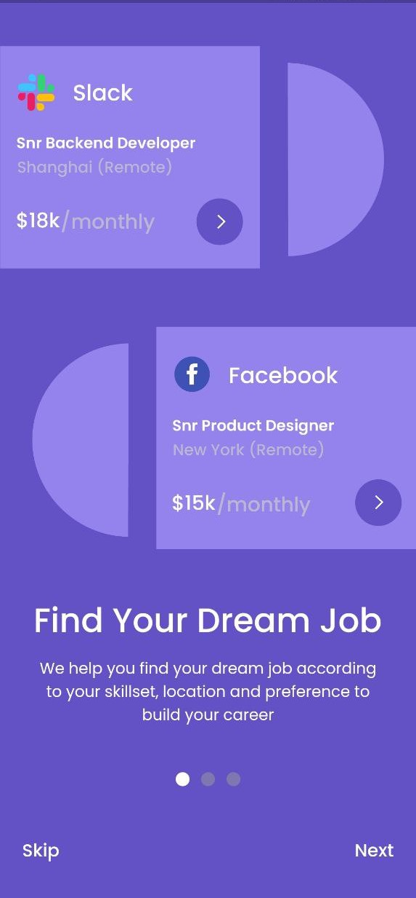
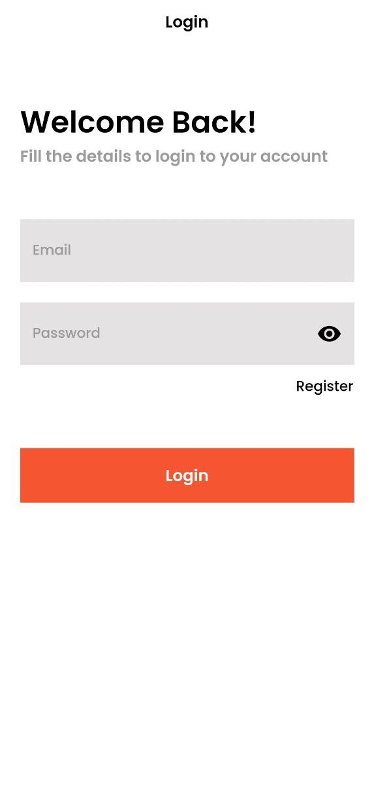
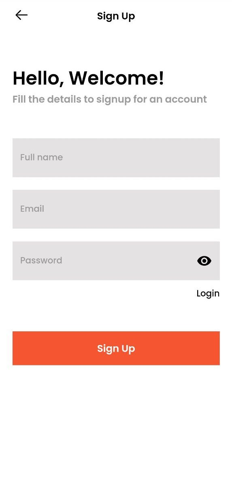
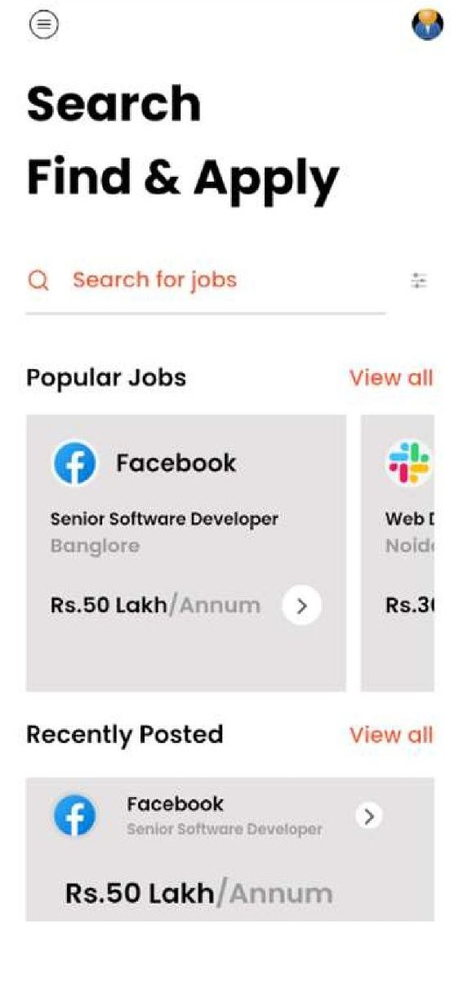
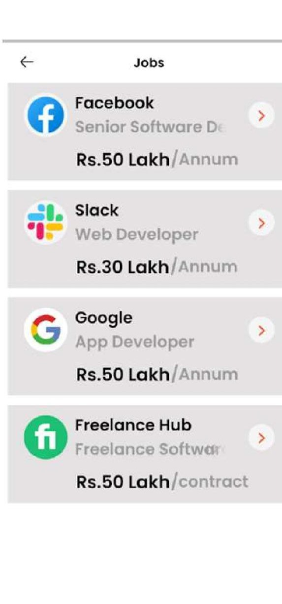
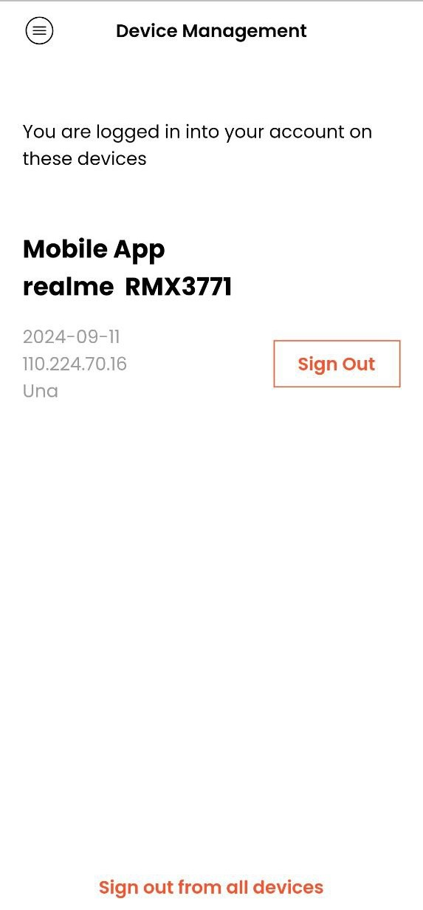
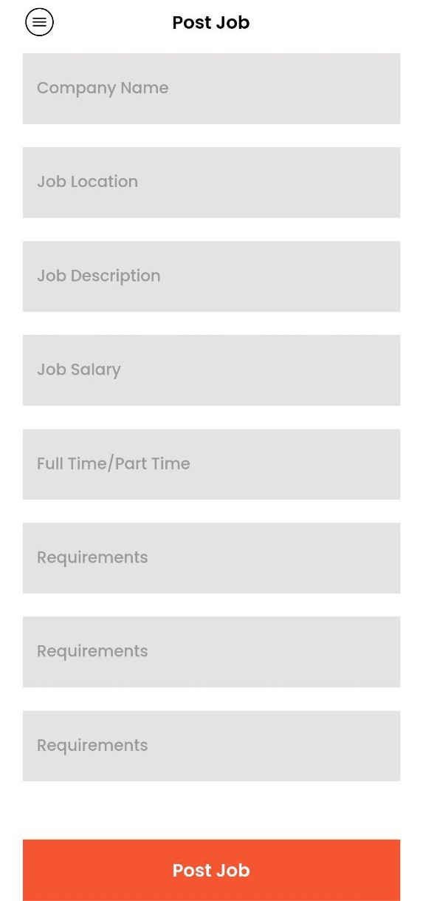
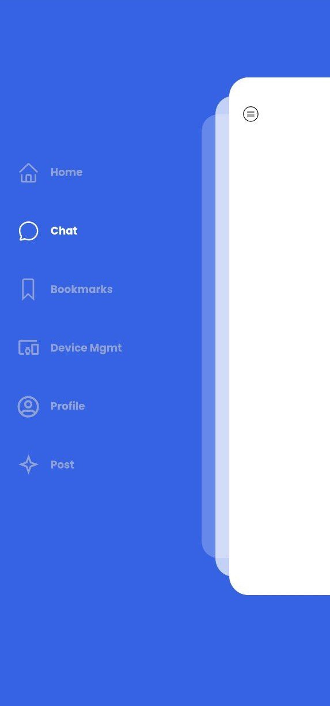

# 🌟 CareerLink

CareerLink is a powerful Flutter application designed to connect employers and job seekers. Employers can post job listings, while employees can apply for jobs and chat with potential employers in real-time. The app leverages Dart for the frontend and a backend powered by Express, Node.js, MongoDB, and Socket.io for seamless chat functionality.

## ✨ Features

- **🔐 User Authentication**: Sign up, log in, and manage user profiles.
- **💼 Job Listings**: Employers can post job openings.
- **📄 Job Applications**: Job seekers can apply for jobs.
- **💬 Real-time Chat**: Real-time messaging between employers and job seekers using Socket.io.

## 🛠️ Tech Stack

- **📱 Frontend**: Flutter, Dart
- **🌐 Backend**: Node.js, Express.js
- **🗄️ Database**: MongoDB
- **⚡ Real-time Chat**: Socket.io

## 📸 Screenshots

Here are some screenshots of the app in action:

### Onboarding Screens

### Login and Register Screens

### Home Screen and Search Result

### Chat Screen and Device Management

### Post Job and Sidebar

